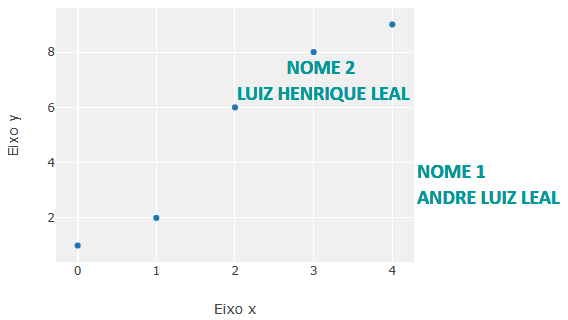

# 1. Customização de gráficos HTML

<p></p>

### 1.1 Introdução

<p align="justify">Os códigos em linguagem de programação R disponíveis neste repositório fornecem as seguintes customizações para gráficos HTML:</p>

<p align="justify">
<li><a target='_blank' rel='noopener noreferrer' href='https://github.com/luizleal1974/Plotly-R-options/blob/main/R%20codes/Figura_1_a.R'><code>Figura_1_a.R</code></a>: Customização de mouseover e fonte.</li>
<li><a target='_blank' rel='noopener noreferrer' href='https://github.com/luizleal1974/Plotly-R-options/blob/main/R%20codes/Figura_1_b.R'><code>Figura_1_b.R</code></a>: Inserção de imagem e equações LaTex. <code>Nota: Adiciona gráficos de linhas utilizando looping.</code></li>
<li><a target='_blank' rel='noopener noreferrer' href='https://github.com/luizleal1974/Plotly-R-options/blob/main/R%20codes/Figura_1_c.R'><code>Figura_1_c.R</code></a>: Customização de fonte no ggplot.</li>
</p>

<p align="justify">Para reproduizr a Figura 1 utilize o código abaixo.</p>

```{r}
# Figura 1
path1 = "https://github.com/luizleal1974/Plotly-R-options/raw/main/R%20codes/Figura_1_a.R"
path2 = "https://github.com/luizleal1974/Plotly-R-options/raw/main/R%20codes/Figura_1_b.R"
path3 = "https://github.com/luizleal1974/Plotly-R-options/raw/main/R%20codes/Figura_1_c.R"
p1 = devtools::source_url(path1) ; p2 = devtools::source_url(path2) ; p3 = devtools::source_url(path3)
p1 ; p2 ; p3
```

<p align="center">

Figura 1. Gráficos HTML.
</p>

</br>


### 1.2 Argumento <code>hoverinfo</code>

<p align="justify">Este argumento permite definir se, e quais, informações serão apresentadas no mouseover. Acesse o arquivo <a target='_blank' rel='noopener noreferrer' href='https://github.com/luizleal1974/Plotly-R-options/blob/main/R%20codes/Hover_Info.R'><code>Hover_Info.R</code></a>.</p>

```{r}
# Mouseover information
path = "https://github.com/luizleal1974/Plotly-R-options/raw/main/R%20codes/Hover_Info.R"
p = devtools::source_url(path)
p
```

<p align="center">

</p>

<div align="center">Figura 2. Hover information.</div>


</br>

### 1.3 Características do <i>hover</i>

<p align="justify">O código de programação sugerido no arquivo <a target='_blank' rel='noopener noreferrer' href='https://github.com/luizleal1974/Plotly-R-options/blob/main/R%20codes/Hover.R'><code>Hover.R</code></a> apresenta formas de customizar o mousehover. <b>É imporatne destacar que na função <code>add_annotations</code> não é possível utilizar estas funcionalidades</b>b.</p>

```{r}
# Mouseover
path = "https://github.com/luizleal1974/Plotly-R-options/raw/main/R%20codes/Hover.R"
p = devtools::source_url(path)
p
```

<p align="center">

</p>

<div align="center">Figura 3. Customização hover.</div>


</br>

</br>


# 2. Customizar marcadores e linhas

<p></p>

### 2.1 Introdução

<p align="justify">Sugestão de código de programação em R para customizar marcadores e linhas (<a target='_blank' rel='noopener noreferrer' href='https://github.com/luizleal1974/Plotly-R-options/blob/main/Marcadores_Linhas.R'><code>Marcadores_Linhas.R</code></a>).</p>

```{r}
# Marcadores e linhas
path = "https://github.com/luizleal1974/Plotly-R-options/raw/main/Marcadores_Linhas.R"
p = devtools::source_url(path)
p
```

<p align="center">

</p>

<div align="center">Figura 4. Marcadores e linhas.</div>


</br>


### 2.2 Customização de marcadores

<p align="justify"> O arquivo <a target='_blank' rel='noopener noreferrer' href='https://github.com/luizleal1974/Plotly-R-options/blob/main/Marker.R'><code>Marker.R</code></a> fornece uma sugestão de código para customizar cores e símbolos dos marcadores.</p>

```{r}
# Marcadores
path = "https://github.com/luizleal1974/Plotly-R-options/raw/main/Marker.R"
p = devtools::source_url(path)
p
```

<p align="center">

</p>

<div align="center">Figura 5. Marcadores: cores e símbolo.</div>


</br>

</br>


# 3. Texto e anotações

Sugestão de código para adicionar texto e anotações no gráfico (<a target='_blank' rel='noopener noreferrer' href='https://github.com/luizleal1974/Plotly-R-options/blob/main/Text_and_Annotations.R'><code>Text_and_Annotations.R</code></a>).

```{r}
# Texto e anotacoes
path = "https://github.com/luizleal1974/Plotly-R-options/raw/main/Text_and_Annotations.R"
p = devtools::source_url(path)
p
```

<p align="center">

</p>

<div align="center">Figura 6. Texto e anotações.</div>


</br>

</br>


# 4. Tabela

<p align="justify"> O código <a target='_blank' rel='noopener noreferrer' href='https://github.com/luizleal1974/Plotly-R-options/blob/main/Tabela.R'><code>Tabela.R</code></a> permite a construção de tabelas.</p>

```{r}
# Tabela
path = "https://github.com/luizleal1974/Plotly-R-options/raw/main/Tabela.R"
p = devtools::source_url(path)
p
```

<p align="center">

</p>

<div align="center">Figura 7. Tabela.</div>


</br>

</br>


# 5. Função definida pelo programador

<p></p>

### 5.1 R console

<p align="justify">Para criar uma função que retorne gráficos em HTML é necessário utilizar o comando <code>print</code>.</p>

```{r}
# Function
f = function(x, tab = TRUE, plt = FALSE){
result = data.frame(prop.table(table(x)))
library(plotly) ; p = plot_ly(x = x, type = "histogram", marker = list(color = "#69b3a2", line = list(color = "black", width = 2))) 
if(tab == TRUE){return(result)}
if(plt == TRUE){print(p)}
}

# Data set
values = c(0, 1, 2, 3, 3, 4, 4, 5, 5, 5, 5, 6, 6, 7, 8, 9)

# Output
f(x = values, tab = TRUE, plt = FALSE)
f(x = values, tab = FALSE, plt = TRUE)
```

</br>


### 5.2 Shiny

<p align="justify">Nos aplicativos <b>Shiny/R</b> deve-se utilizar a estrutura contida no arquivo <a target='_blank' rel='noopener noreferrer' href='https://github.com/luizleal1974/Plotly-R-options/blob/main/app.R'><code>app.R</code></a>.</p>

```{r}
# Load app
path = "https://github.com/luizleal1974/Plotly-R-options/raw/main/app.R"
devtools::source_url(path)

# Run app
shinyApp(ui, server)
```


</br>

</br>


# 6. Funções

<p align="justify">É possível construir funções que contenham um conjunto de comandos e, a partir um destas funções, construir um gráfico. Tem-se a seguir uma estrutura básica na qual é importante destacar que o elemento <code><b>p</b></code> representa, simultânemante, o argumento das funções e o objeto no qual o gráfico deve ser armazenado.</p>

<table width="100%">
  <tr>
  <td> suppressWarnings(suppressMessages(library(plotly))) </br> f1 = function(<code><b>p</b></code>, mostra) &nbsp; layout(<code><b>p</b></code>, showlegend = mostra) </br> f2 = function(<code><b>p</b></code>, estilo) add_trace(<code><b>p</b></code>, x = c(-1, 1), y = c(-2, 2), type = estilo, mode = 'markers') </br> <code><b>p</b></code> = plot_ly() </br> <code><b>p</b></code> = <code><b>p</b></code> %>% </br> f1(mostra = TRUE) %>% </br> f2(estilo = 'scatter') </br> <code><b>p</b></code> </td>
  </tr>
</table>

<p align="justify">No código de programação sugerido a seguir, o gráfico é construído a partir de duas funções definidas pelo programador: (i) a função <code>features</code> define o <i>background</i> do gráfico e adiciona um texto em uma posição (x;y) pré-definida; (ii) a função <code>curva</code> estabele os padrões do gráfico de linhas. Eventualmente este tipo de abordagem pode ser útil na construção de gráficos.</p>

```{r}
suppressWarnings(suppressMessages(library(plotly)))

# ====== Features (Function set by user) ====== #
features = function(p, x_pos, y_pos){
           margens = list(autoexpand = FALSE, b = 200, t = 200, r = 500, l = 500)
           ax = list(title = "Eixo x", zerolinecolor = 'rgb(255, 255, 255)', zerolinewidth = 2, gridcolor = 'rgb(255, 255, 255)')
           ay = list(title = "Eixo y", zerolinecolor = 'rgb(255, 255, 255)', zerolinewidth = 2, gridcolor = 'rgb(255, 255, 255)')
           layout(p, plot_bgcolor = 'rgb(240, 240, 240)', xaxis = ax, yaxis = ay,margin = margens, showlegend = TRUE) %>% add_annotations(xref = "x", yref = "y", x = x_pos, y = y_pos, xanchor = 'left', yanchor = 'bottom', text = "<b>NOME 2</b>", font = list(family = 'Calibri', size = 20, color = '#009999'), showarrow = FALSE)
           }

# ====== Lines (Function set by user) ====== #
curva = function(p, linha, x_val, y_val, curve_color){
        ROTULOS = paste("<b>Valores</b>", paste("x values: ", x_val, sep = ""), paste("y values: ", y_val, sep = ""), sep = "\n")
        NOME = paste("Curva ", linha, sep = "")
        add_trace(p, x = x_val, y = y_val, hoverinfo = "text", hovertext = ROTULOS, type = 'scatter', mode = 'lines', name = NOME, line = list(color = curve_color), showlegend = TRUE)
        }

# Dados
x1 = c(0, 1, 2, 3, 4) ; y1 = c(1, 2, 6, 8, 9)
x2 = c(0, 1, 2, 3, 4) ; y2 = c(2, 4, 5, 3, 1)

# Grafico
p = plot_ly()
p = p %>%
curva(linha = 1, x_val = x1, y_val = y1, curve_color = 'steelblue') %>%   # Function set by user
curva(linha = 2, x_val = x2, y_val = y2, curve_color = 'crimson') %>%     # Function set by user
features(x_pos = 1, y_pos = 8)                                            # Function set by user
p
```

